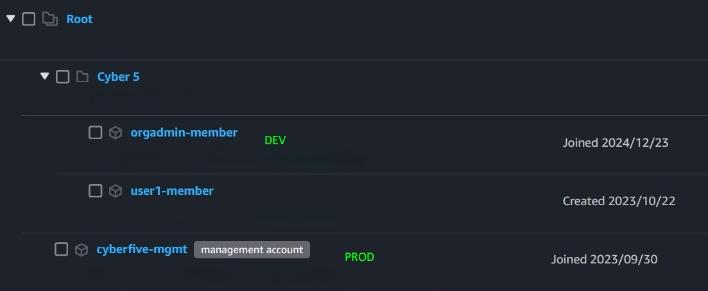

- For this setup, we use AWS Organizations supporting linking multiple accounts. 
- Since cross-account access permissions must be set two-way, you need to ensure that the user authenticating from the parent account must have "sts:assumerole" permission, and the role that is to be assumed in the child account should have a trust relationship setup to allow this user.

My setup is as follows:

Cross-account IAM Access role: _OrganizationAccountAccessRole_

Account used for deployment: User with Admin role in _cyberfive-mgmt_ (management account)

Prod account = _cyberfive-mgmt_
Dev account = _orgadmin-member_