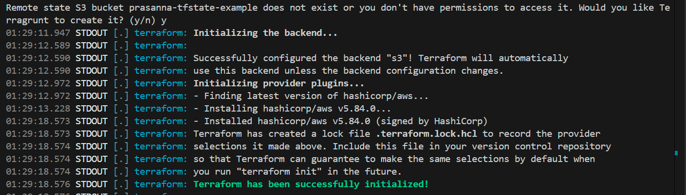

Reference links:
1. [Generate Backend configuration file automatically](https://terragrunt.gruntwork.io/docs/features/state-backend/#generating-remote-state-settings-with-terragrunt)
2. [Create Backend resources automatically](https://terragrunt.gruntwork.io/docs/features/state-backend/#create-remote-state-resources-automatically)
3. [Terragrunt Reference Architecture](https://github.com/antonbabenko/terragrunt-reference-architecture)

Steps:

1. Create a `root.hcl` app outside of all modules, in the root directory
2. Also create a `terragrunt.hcl` file in every module, wherever you want a backend to be created.
3. Go to the specific module, and run `terragrunt init`. This will generate a backend for your module.

**Note**:

1. **Manage Remote backend**: If you already have a backend (S3 & DynamoDB) setup for saving your statefiles, you can use the `generate` block in `root.hcl`. Otherwise, you can use `remote_state` block to create those backend using terragrunt. You cannot have both at the same time.

